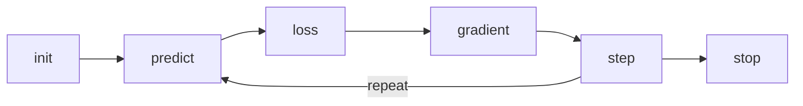

# Fastbook

Notes from the [Fastbook][1].

The simplest equation that can power an AI is:

```python
w * x + b = y
```

- Where `x` is the input, `y` is the output. `w` and `b` are weights and biases (so that `x=0` is handled).
- During training, we learn the perfect values for `w` and `b` for the given values of `x` and `y`.
- During prediction, we use the same equation with the learned values of `w` and `b` to get the value of `y` for a given value of `x`.


### Chapter 1: Intro

- GPUs are capable of PDP (parallel distributed processing), an important ability necessary to train AI models mimicking the neural networks in our brain.
- As of now it's preferable to rent GPUs than to buy them because
  - Prices and specs are rapidly changing.
  - Hard to setup.
  - Hard to maintain.
- "Deep Learning" is the state of the art machine learning approach, usable in a wide range of applications.
- Two things can be learned by AI are - text and visual data.
- Many kinds of data (e.g. sound, temperature) can be represented as pictures, and thus be used by a visual learner.
- An "architecture" is the implementation of a deep leaning algorithm that can recognize patterns from the given set of inputs and outputs, and use them to predict outputs for future inputs, even unseen ones.
- A "model" is an instance of an architecture with parameters, i.e. an instance of an architecture that has learned things.
- "resnet34" is an example of a pre-trained model using the CNN (Convolutional Neural Network) architecture with 34 layers.
- While learning, the model goes through the training data, often multiple times, each time, storing the recognized patterns in its layers as values called "parameters" aka "weights" + "biases".
- The last layer of a model, aka the "head", stores the most specialized parameters for the dataset it has been trained on.
- While training a pre-trained model, the parameters in the latter layers, specially the head is replaced with new parameters acquired from the new dataset.
- It's easier and faster to fine-tune, i.e. train a pre-trained model, than training one from scratch.
- Before training, the learner sets aside about 20% of the data for validation after the training.
- Use the same set of data for validation in all iterations to avoid bias.
- The error rate (percentage of incorrect predictions) should reduce after each epoch (iteration) of processing the dataset.
- Too much training on limited data can cause over-fitting, i.e. the model starts memorizing outputs for the given inputs, rather than predicting.
- Over-fitting will cause error rate to increase.
- There the two kinds of predictions: Classification and regression.
- Classification: given an input, predict the matching label as output from a given set of discrete labels (e.g. recognizing dogs vs cats).
- Regression: given a continuous series of inputs, predict the future trajectory of the series as output (e.g. predicting temperature changes).

```python
# Import all the useful utilities to train a visual learning model
from fastai.vision.all import *

# Download and extract dataset
path = untar_data(URLs.PETS)/'images'

# Function to process a filename and return the label
def is_cat(x):
  return x[0].isupper()

# A loader that can load data and label them by processing filenames
data_loaders = ImageDataLoaders.from_name_func(
  path,  # path to the dataset
  get_image_files(path),  # The input data.
  valid_pct=0.2,  # Set aside 20% for validation after training.
  seed=42,  # Use the same seed in each epoch to ensure same set of validation data is used.
  label_func=is_cat,  # Function to process labels from filename
  item_tfms=Resize(224),  # Resize the images to the same size for processing them efficiently in GPU.
)

# Use a CNN implementation with 34 layers
architecture = resnet34

# Use predefined function error_rate for validating and measuring the quality
metric = error_rate

# Initialize the vision learner model
learner = vision_learner(
  data_loaders,
  architecture,
  metrics=metrics,
)

# Fine-tune the pre-trained model in 1 epoch (iteration)
learner.fine_tune(1)
```

### Chapter 2: Production

- Use the [Drivetrain][3] approach to get better results.
- When training vision learning models, use Data Augmentation i.e. transform the training images by cropping, rotating, applying filters etc.
- Think about the possible biases in the dataset.
- Train a small model first, and use that to clean the data before training bigger models.
- Data cleaning can be done by plotting confusion matrix (`ClassificationInterpretation().plot_confusion_matrix()`).
- Create notebook apps as POC first.
- To avoid disaster, do human checks, keep the scope limited, expand gradually.
- Be aware of positive feedback loops, where the model starts learning biases when data doesn't represent the intention.

### Chapter 3: Ethics

Computers can be (too) powerful. Be responsible.

### Chapter 4: MNIST basics

- MNIST is a popular dataset containing images of handwritten digits.
- We generally use the Image library from PIL to work on images, it's supported directly by Jupyter Notebook.
- numpy "array" and pytorch "tensor" are mathematical data structures (matrix) that can store values of any dimension.
  - Single digit i.e. scalar i.e. rank 0
  - Array of digits i.e. vector i.e. rank 1
  - Array of array of digits i.e. matrix i.e. rank 2
  - Multi rank matrix and matrices
- They are almost similar, but tensor restricts its elements to be of the same type and shape, which lets it utilize the GPU and provide some other conveniences required for deep learning.
- Images can be stored in a tensor by dividing each pixel by 255.
- Image stored in a tensor can be shown in Jupyter notebook using the `show_image()` function.
- Multiple images can be stacked into a tensor using the `torch.stack()` function.
- The first axis of the stacked tensor is the indexes of the images.
- To implement a simple digit recognizer without using deep learning is to compare the target image with the ideal image (mean of all the images of the same category).
- Get the mean image of all stacked images using the `.mean()` method.
- `.mean((-1,-2))` will take the mean ranging over the values indexed by the last two axes (horizontal, vertical) of the stacked tensor.
- Get the mean absolute value loss (L1 loss) (`(img1-img2).abs().mean()`) using the `F.l1_loss()` function.
- Get the mean squared error (MSE) (`((img1-img2)^2).mean().sqrt()`) using the `F.mse_loss()` function.
- These functions can be used to get the differences between two images.
- As compared to L1 loss, MSE is more strict towards large differences.

Typical deep learning flow:



- Init: Initialize the parameters to random values.
- Loss: A number that is small for good performance (prediction).
- Gradient: A measure of - for each weight, how changing that weight would change the loss, i.e. d(loss) / d(weight), for each weight, treating other weights as constant.
- Step: Increase of decrease the weights a bit to minimize the loss. Use calculus magic to avoid doing it the slow way (i.e. try and measure).
- Stop: We can stop the loop either after a specific number of iterations (epochs), or until the accuracy starts degrading.

Code for implementing (unoptimized) linear learner for classifying images of 3s and 7s and training it:

```python
def sigmoid(x):
    """Function to ensure the loss is between (0, 1)."""
    return 1 / (1 + torch.exp(-x))

def batch_accuracy(predictions_batch, targets_batch):
    preds = predictions_batch.sigmoid()  # i.e. sigmoid(prediction_batch)
    threes = preds > 0.5
    correct = threes == targets_batch
    return correct.float().mean()

def mnist_loss(predictions, targets):
    predictions = predictions.sigmoid()

    # Similar to [(1-predictions)[i] if targets[i]==1 else predictions[i] for i in range(len(targets))]
    # but faster (uses GPU)
    loss = torch.where(targets==1, 1-predictions, predictions).mean()

    return loss

def init_params(size, std=1.0):
    params = torch.randn(size) * std

    # Tell pytorch to track the gradient, i.e. d(loss) / d(weight) for each param
    # which is updated via `params.backward()`, and accessible via params.grad
    params = params.requires_grad_()

    return params

# Similar to Pytorch's nn.Linear()
class LinearModel:
    """A simple linear model."""
    def __init__(self, in_features, out_features):
        self.weights = init_params((in_features, out_features))  # torch.Size([in_features, out_features])
        # w*x will always be 0 if "x" is 0. Hence, we need a bias "b"
        # So, the eq is: y = w*x + b
        self.bias = init_params(out_features)  # torch.Size([out_features])

    def parameters(self):
        return self.weights, self.bias

    def __call__(self, xb):
        return (xb @ self.weights) + self.bias  # Matrix multiplication

class SimpleLearner:
    """A simple learner to train models."""
    def __init__(self, data_loaders, model):
        self.data_loaders = data_loaders
        self.model = model

    def calculate_gradient(self, image, target):
        """Calculate gradients i.e. slope i.e. `d(loss) / d(weight)` of weights and biases.

        If it's is very small, it means we're closer to the optimal value.
        """

        predictions = self.model(image)
        loss = mnist_loss(predictions, target)

        # Updates self.model.parameters[n].grad for each layer, see init_params()
        # It could've been named `.calculate_gradient()` to make life easier.
        loss.backward()

    def step(self, learning_rate):
        """Step function to update the weights and biases.

        If learning rate is too low, it might require a lot of steps to reach the optimal value.
        If learning rate is too high, it might result in loss getting worse, or bounce around in circles.
        """
        for param in self.model.parameters():
            param.data -= param.grad.data * learning_rate

    def reset_gradient(self):
        """Reset the calculated gradients."""
        for p in self.model.parameters():
            p.grad = None

    def train_epoch(self, learning_rate):
        for batch_of_images, batch_of_targets in self.data_loaders.train:
            self.calculate_gradient(batch_of_images, batch_of_targets)
            self.step(learning_rate)
            self.reset_gradient()

    def validate_epoch(self):
        accuracy = []
        for batch_of_images, batch_of_targets in self.data_loaders.valid:
            batch_of_predictions = self.model(batch_of_images)
            acc = batch_accuracy(batch_of_predictions, batch_of_targets)
            accuracy.append(acc)

        return round(torch.stack(accuracy).mean().item(), 4)

    def train_model(self, epochs, learning_rate):
        for _ in range(epochs):
            self.train_epoch(learning_rate)
            print(self.validate_epoch(), end=' ')

# Load data from MNIST dataset
path = untar_data(URLs.MNIST_SAMPLE)
Path.BASE_PATH = path

# Load images into pytorch tensors

# Load data from MNIST dataset
path = untar_data(URLs.MNIST_SAMPLE)
Path.BASE_PATH = path

# Load images into pytorch tensors

train_threes = (path/'train'/'3').ls().sorted()
train_threes = torch.stack([tensor(Image.open(o)) for o in train_threes]).float() / 255

valid_threes = (path/'valid'/'3').ls().sorted()
valid_threes = torch.stack([tensor(Image.open(o)) for o in valid_threes]).float() / 255

train_sevens = (path/'train'/'7').ls().sorted()
train_sevens = torch.stack([tensor(Image.open(o)) for o in train_sevens]).float() / 255

valid_sevens = (path/'valid'/'7').ls().sorted()
valid_sevens = torch.stack([tensor(Image.open(o)) for o in valid_sevens]).float() / 255

train_images = torch.cat([train_threes, train_sevens]).view(-1, 28*28)
train_targets = tensor([1]*len(train_threes) + [0]*len(train_sevens)).unsqueeze(1)
train_dset = list(zip(train_images, train_targets))

valid_images = torch.cat([valid_threes, valid_sevens]).view(-1, 28*28)
valid_targets = tensor([1]*len(valid_threes) + [0]*len(valid_sevens)).unsqueeze(1)
valid_dset = list(zip(valid_images, valid_targets))

# Batch size is a tradeoff between speed vs GPU memory
train_dl = DataLoader(train_dset, batch_size=256)
valid_dl = DataLoader(valid_dset, batch_size=256)

data_loaders = DataLoaders(train_dl, valid_dl)

# Using our custom learner
model = LinearModel(28*28, 1)
learner = SimpleLearner(data_loaders, model)
learner.train_model(20, learning_rate=1.0)

## Similar to Pytorch's Learner
# model = nn.Linear(28*28, 1)
# learn = Learner(data_loaders, model, opt_func=SGD, loss_func=mnist_loss, metrics=batch_accuracy)
# learn.fit(20, lr=1.0)
#
## Plot the recorded learning proces with
# plt.plot(L(learn.recorder.values).itemgot(2));
# print("Final accuracy:", learn.recorder.values[-1][2])
```

- To turn it into a more complex and capable neural network, we need to add more layers.
- Just adding more linear layers isn't very useful because multiple linear layers in a row can be represented
  with one single layer with a different set of parameters. It's not true if there's a non-linear layer
  between them (e.g. ReLU).
- Deeper models, i.e. models with more layers require less parameters, hence are faster, but harder to train (i.e. optimize the params).

```python
class SimpleNet:
    """A simple multi layer neural network."""
    def __init__(self, in_features, out_features):
        # Layer 1: Linear
        # Has 30 output activations, meaning the first layer can construct 30 different
        # features, each representing some different mix of pixels, it can be anything based on
        # complexity.
        self.layer1 = LinearModel(in_features, 30)

        # Layer 2: Nonlinearity a.k.a Activation Function
        # Similar to `F.relu` i.e. Rectified Linear Unit to replace all negative numbers to zero.
        self.layer2 = lambda xb: xb.max(tensor(0.0))

        # Layer 3: Linear
        # Must have 30 inputs activations so they match.
        self.layer3 = LinearModel(30, out_features)

    def parameters(self):
        w1, b1 = self.layer1.parameters()
        w2, b2 = self.layer3.parameters()
        return w1, b1, w2, b2

    def __call__(self, xb):
        res = self.layer1(xb)
        res = self.layer2(res)
        res = self.layer3(res)
        return res

model = SimpleNet(28*28, 1)

## Similar to Pytorch's
# model = nn.Sequential(
#     nn.Linear(28*28, 30),  # Layer 1
#     nn.ReLU(),             # Layer 2
#     nn.Linear(30, 1),      # Layer 3
# )
```

### Chapter 5: Pet Breeds

- "Presizing" of images is necessary to ensure images are of the same dimension, so they can collate into tensors.
- To make the presizing transformations faster without losing pixels:
  - `item_tfms`: First resize image to a relatively larger dimension to avoid empty spaces after the transformations.
  - `batch_tfms`: Compose all other transformations, including resizing to the final dimension, into one single transformation, and perform it in GPU.
- Use `DataLoaders().show_batch(nrows: int, ncol: int)` to ensure data and labels are correct. Use `.summary(path: Path)` to debug issues.
- If not provided, fastai will select a loss function automatically based on the dataset.
- Use `DataLoaders().one_batch()` to get a batch of tensors, and pass it to `Learner().get_preds()` to get predictions for it.
- "Softmax", a multi-category equivalent of "Sigmoid", is an activation function used in the final layer to ensure the numbers are between 0-1 and add up to 1.

  ```python
  # For any increase in x, exponential(x) increases very rapidly.
  # It ensures all the numbers are positive, and amplifies the slightly bigger numbers
  exponential = lambda x: e ** x  # e ~= 2.718,

  # Dividing by sum ensures all the numbers add up to 1
  softmax = lambda x: exponential(x) / exponential(x).sum(dim=1, keepdim=True)
  ```

- For more that two categories, we need an activation per category.
- Logarithms increase linearly when the underlying signal increases exponentially or multiplicatively.

  ```python
  log(a * b) = log(a) + log(b)
  ```

  i.e. multiplication, which can create really large or really small numbers, can be replaced by addition,
  which is much less likely to result in scales that are difficult for computers to handle.

- To classify categories from loss, we need to invert the scale of log function, i.e. `-1 * log(loss)`.
- Cross-Entropy Loss (`nn.CrossEntropyLoss(reduction='none')`/`F.cross_entropy`), aka Negative Log Likelihood loss (`F.nll_loss`) works on images,
  of more than two categories, is faster and reliable. `reduction='none'` disables taking mean of the loss of all items.

  ```python
  cross_entropy = lambda activations, targets: nll_loss(log_softmax(activations, targets))
  ```

- Plot confusion matrix to interpret loss functions.

  ```python
    interp = ClassificationInterpretation.from_learner(learner)
    interp.plot_confusion_matrix(figsize=(12,12), dpi=60)

    # Use this method to get the confusion matrix with the most incorrect predictions.
    interp.most_confused(min_val=5)
  ```

- Use `Learner().lr_find(suggest_funcs=(minimum, steep))` to find a suitable learning rate.

[1]: https://github.com/fastai/fastbook
[2]: https://www.fast.ai
[3]: https://www.oreilly.com/radar/drivetrain-approach-data-products
